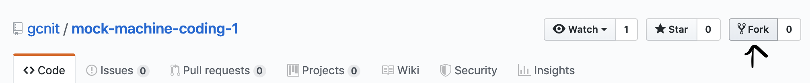
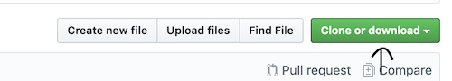
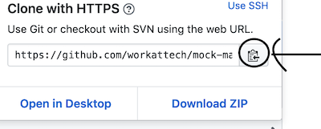
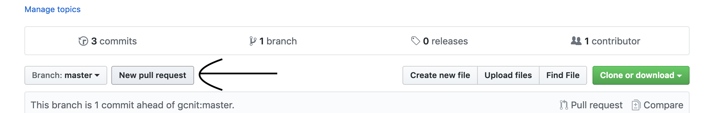
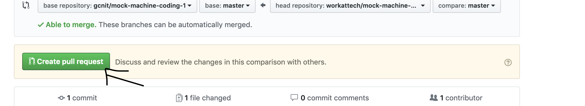

# Create Github Account
1. Create account at: https://github.com/join by choosing an unique username
2. Check your email for verification email and click on verification link

# Install Git Locally

## Windows
- Download git from https://gitforwindows.org/
- When you've successfully started the installer, you should see the Git Setup wizard screen. Follow the Next and Finish prompts to complete the installation. The default options are pretty sensible for most users.
- Open a Command Prompt (or Git Bash if during installation you elected not to use Git from the Windows Command Prompt).
- Run the following commands to configure your Git username and email using the following commands, replacing Emma's name and email with your own. These details will be associated with any commits that you create:
```
git config --global user.name "Emma Paris"
git config --global user.email "eparis@atlassian.com"
```

## Linux
- From your shell, install Git using apt-get:
```   
sudo apt-get update
sudo apt-get install git
```
- Verify the installation was successful by typing git --version which should return the version number:
```
git --version
```
- Run the following commands to configure your Git username and email using the following commands, replacing Emma's name and email with your own. These details will be associated with any commits that you create:
```
git config --global user.name "Emma Paris"
git config --global user.email "eparis@atlassian.com"
```

## Mac
- From your shell, install Git using Homebrew:
```   
brew install git
```
- Verify the installation was successful by typing git --version which should return the version number:
```
git --version
```
- Run the following commands to configure your Git username and email using the following commands, replacing Emma's name and email with your own. These details will be associated with any commits that you create:
```
git config --global user.name "Emma Paris"
git config --global user.email "eparis@atlassian.com"
```

These commands have been taken from Atlassian's website.

# Fork
- In the repository page, click on "Fork"

- After clicking on Fork, you'll be redirected to a new page with a copy of the repository.
- This new repository is where you'll make your code changes.
- Then click on clone in this new page

# Clone
- In the repository page, click on "Clone or download"



- Then click on copy link button



- Go to the terminal and clone the repository on your machine by typing:
```git clone``` followed by the link you copied in previous step and hit enter.

# Push local changes to remote
Execute these commands on the terminal:
- ```cd mock-machine-coding-1```
- ```git add .```
- ```git commit -m "solved the problem"```
- ```git push```

# PR
- Open the repository in your profile. The URL would be of this format: ```https://github.com/<your-username>/mock-machine-coding-1```
- Click on "New Pull Request".

- Then click on "Create pull request" in the page that opened.

- Again click on the new button that says "Create pull request"
- After this step, a new page would load which would be your pull request.
