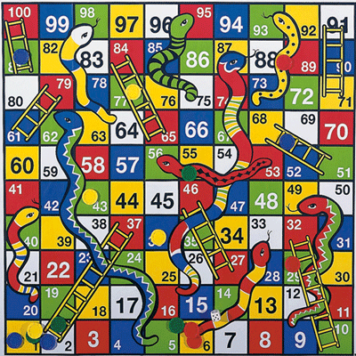

# Snake and Ladder

## Problem Statement
Create a snake and ladder application. The application should take as input (from the command line or a file):
- Number of snakes (s) followed by s lines each containing 2 numbers denoting the head and tail positions of the snake.
- Number of ladders (l) followed by l lines each containing 2 numbers denoting the start and end positions of the ladder.
- Number of players (p) followed by p lines each containing a name.

After taking these inputs, you should print all the moves in the form of the current player name followed by a random number between 1 to 6 denoting the die roll and the initial and final position based on the move.
<br>
Format: ```<player_name> rolled a <dice_value> and moved from <initial_position> to <final_position>```

When someone wins the game, print that the player won the game.
<br>
Format: ```<player_name> wins the game```

## Rules of the game
- The board will have 100 cells numbered from 1 to 100.
- The game will have a six sided dice numbered from 1 to 6 and will always give a random number on rolling it.
- Each player has a piece which is initially kept outside the board (i.e., at position 0).
- Each player rolls the dice when their turn comes.
- Based on the dice value, the player moves their piece forward that number of cells. Ex: If the dice value is 5 and the piece is at position 21, the player will put their piece at position 26 now (21+5).
- A player wins if it exactly reaches the position 100 and the game ends there.
- After the dice roll, if a piece is supposed to move outside position 100, it does not move.
- The board also contains some snakes and ladders.
- Each snake will have its head at some number and its tail at a smaller number.
- Whenever a piece ends up at a position with the head of the snake, the piece should go down to the position of the tail of that snake. 
- Each ladder will have its start position at some number and end position at a larger number.
- Whenever a piece ends up at a position with the start of the ladder, the piece should go up to the position of the end of that ladder.
- There could be another snake/ladder at the tail of the snake or the end position of the ladder and the piece should go up/down accordingly.

## Assumptions you can take apart from those already mentioned in rules
- There won’t be a snake at 100.
- There won’t be multiple snakes/ladders at the same start/head point.
- It is possible to reach 100, i.e., it is possible to win the game.
- Snakes and Ladders do not form an infinite loop.

## Sample Input
```
9
62 5
33 6
49 9
88 16
41 20
56 53
98 64
93 73
95 75
8
2 37
27 46
10 32
51 68
61 79
65 84
71 91
81 100
2
Gaurav
Sagar
```

## Sample Output
```
Gaurav rolled a 6 and moved from 0 to 6
Sagar rolled a 1 and moved from 0 to 1
Gaurav rolled a 6 and moved from 6 to 12
Sagar rolled a 4 and moved from 1 to 5
Gaurav rolled a 4 and moved from 12 to 16
Sagar rolled a 6 and moved from 5 to 11
Gaurav rolled a 5 and moved from 16 to 21
Sagar rolled a 4 and moved from 11 to 15
Gaurav rolled a 1 and moved from 21 to 22
Sagar rolled a 6 and moved from 15 to 21
Gaurav rolled a 6 and moved from 22 to 28
Sagar rolled a 2 and moved from 21 to 23
Gaurav rolled a 6 and moved from 28 to 34
Sagar rolled a 6 and moved from 23 to 29
Gaurav rolled a 5 and moved from 34 to 39
Sagar rolled a 2 and moved from 29 to 31
Gaurav rolled a 2 and moved from 39 to 20
Sagar rolled a 5 and moved from 31 to 36
Gaurav rolled a 3 and moved from 20 to 23
Sagar rolled a 5 and moved from 36 to 20
Gaurav rolled a 6 and moved from 23 to 29
Sagar rolled a 3 and moved from 20 to 23
Gaurav rolled a 2 and moved from 29 to 31
Sagar rolled a 3 and moved from 23 to 26
Gaurav rolled a 3 and moved from 31 to 34
Sagar rolled a 5 and moved from 26 to 31
Gaurav rolled a 3 and moved from 34 to 37
Sagar rolled a 4 and moved from 31 to 35
Gaurav rolled a 2 and moved from 37 to 39
Sagar rolled a 5 and moved from 35 to 40
Gaurav rolled a 2 and moved from 39 to 20
Sagar rolled a 5 and moved from 40 to 45
Gaurav rolled a 2 and moved from 20 to 22
Sagar rolled a 6 and moved from 45 to 68
Gaurav rolled a 3 and moved from 22 to 25
Sagar rolled a 3 and moved from 68 to 91
Gaurav rolled a 5 and moved from 25 to 30
Sagar rolled a 2 and moved from 91 to 73
Gaurav rolled a 5 and moved from 30 to 35
Sagar rolled a 6 and moved from 73 to 79
Gaurav rolled a 5 and moved from 35 to 40
Sagar rolled a 1 and moved from 79 to 80
Gaurav rolled a 4 and moved from 40 to 44
Sagar rolled a 2 and moved from 80 to 82
Gaurav rolled a 5 and moved from 44 to 9
Sagar rolled a 4 and moved from 82 to 86
Gaurav rolled a 1 and moved from 9 to 32
Sagar rolled a 6 and moved from 86 to 92
Gaurav rolled a 3 and moved from 32 to 35
Sagar rolled a 4 and moved from 92 to 96
Gaurav rolled a 1 and moved from 35 to 36
Sagar rolled a 1 and moved from 96 to 97
Gaurav rolled a 1 and moved from 36 to 37
Sagar rolled a 5 and moved from 97 to 97
Gaurav rolled a 6 and moved from 36 to 42
Sagar rolled a 3 and moved from 97 to 100
Sagar wins the game
```



## Expectations
- Make sure that you have a working and demonstrable code
- Make sure that the code is functionally correct
- Code should be modular and readable
- Separation of concern should be addressed
- Please do not write everything in a single file
- Code should easily accommodate new requirements and minimal changes
- There should be a main method from where the code could be easily testable
- [Optional] Write unit tests, if possible
- No need to create a GUI

## Optional Requirements
**Please do these only if you’ve time left**. You can write your code such that these could be accommodated without changing your code much.
- The game is played with two dice instead of 1 and so the total dice value could be between 2 to 12 in a single move.
- The board size can be customizable and can be taken as input before other input (snakes, ladders, players).
- In case of more than 2 players, the game continues until only one player is left.
- On getting a 6, you get another turn and on getting 3 consecutive 6s, all the three of those get cancelled.
- On starting the application, the snakes and ladders should be created programmatically without any user input, keeping in mind the constraints mentioned in rules.

## Setup process
Please go through the setup process <a href="https://workattech.github.io/mock-machine-coding-1/#setup" target="_blank">here</a>.

## Submission
- You've 3 hours to submit the solution. Please submit by 7 PM if you start at 4 PM.
- Please go through the submission process <a href="https://workattech.github.io/mock-machine-coding-1/#submission" target="_blank">here</a>.